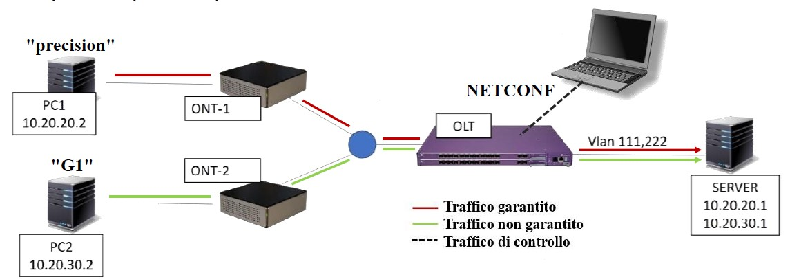

# Bachelor-Thesis
This repository contains my bachelor thesis project under the title "Software Defined Control of a Passive Optical Network". This repository includes the [thesis](https://github.com/stehin/Bachelor-Thesis/blob/main/Thesis.pdf), the powerpoint [presentation](https://github.com/stehin/Bachelor-Thesis/blob/main/Thesis_presentation.pdf) and all [code](https://github.com/stehin/Bachelor-Thesis/tree/main/Code) developed and used in the experimental section. The covered topics are: Software Defined Networking (SDN), NETCONF, YANG, Passive Optical Networks (PON). 

